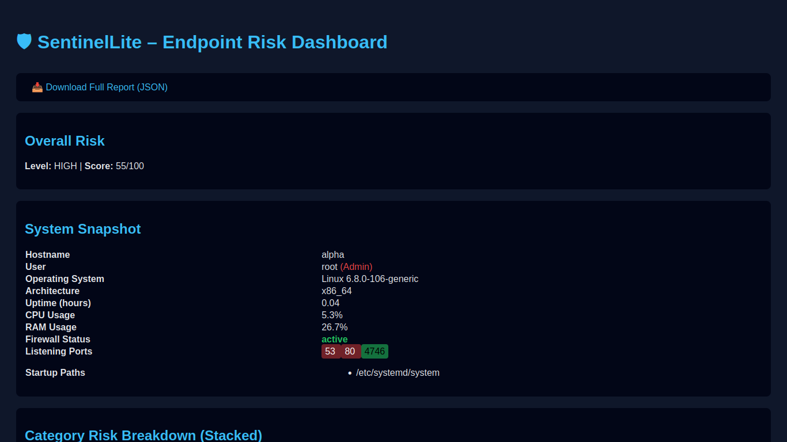
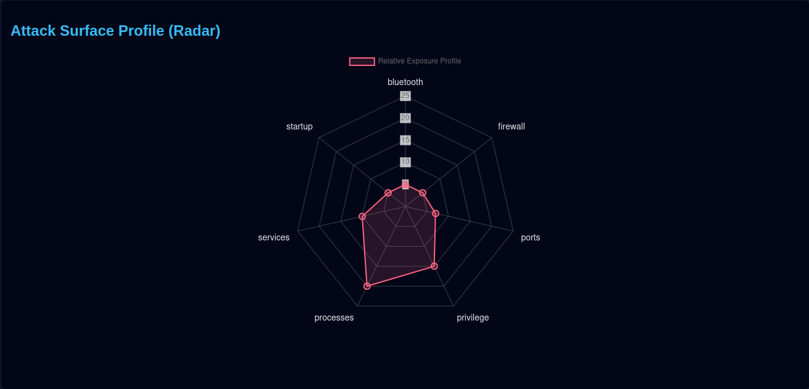
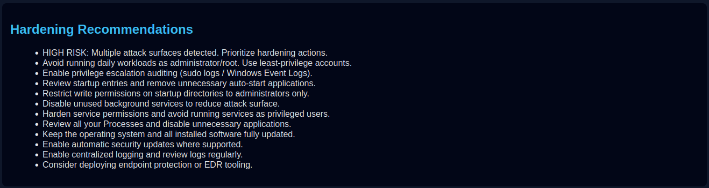

# 🛡 SentinelLite

**A Lightweight Endpoint Security Analyzer with Risk Scoring & Interactive Dashboard**

SentinelLite is a Python-based security analysis tool that inspects your local system for potential risks and presents a structured security assessment through an interactive web dashboard. It is designed to demonstrate practical concepts in system security, risk modeling, and monitoring.

---

## 🚀 Overview

Modern systems often run multiple services and processes that can unintentionally expose vulnerabilities. SentinelLite helps identify these risks by analyzing:

* Open network ports
* Running processes
* Firewall status
* Privilege levels

It then converts this data into a **quantified risk score**, along with actionable recommendations.

---

## ✨ Key Features

### 🔍 System Inspection

* Detects open/listening ports
* Identifies privilege level (user vs admin/root)
* Checks firewall status
* Flags potentially suspicious processes

### 🧠 Risk Scoring Engine

* Context-aware scoring model
* Differentiates between common and suspicious ports
* Includes process-based risk signals
* Produces a structured risk breakdown

### 🛡 Security Recommendations

* Generates targeted hardening suggestions
* Based directly on detected system conditions

### 📊 Interactive Dashboard

* Real-time risk score display
* Category-wise breakdown visualization
* Recommendations panel
* Clean and minimal UI powered by Flask + Chart.js

---

## 📸 Screenshots

### Dashboard Overview



### Risk Breakdown



### Recommendations



---

## 🏗 Project Structure

```
SentinelLite/
│
├── agent.py          # Collects system data
├── risk.py           # Risk scoring engine
├── hardening.py      # Recommendation generator
├── dashboard.py      # Flask backend
│
├── templates/
│   └── index.html    # Frontend UI
│
├── screenshots/      # Project visuals
├── requirements.txt
└── README.md
```

---

## ⚙️ Installation

Clone the repository and install dependencies:

```bash
git clone https://github.com/tanush-0/sentinelite.git
cd sentinelite
pip install -r requirements.txt
```

---

## ▶️ Usage

### 1. Collect System Data

```bash
python agent.py
```

### 2. Launch Dashboard

```bash
python dashboard.py
```

### 3. Open in Browser

```
http://127.0.0.1:5000
```

---

## 🧠 How Risk Scoring Works

The total risk score (0–100) is derived from multiple weighted factors:

| Category  | Description                                    |
| --------- | ---------------------------------------------- |
| Privilege | Elevated privileges increase risk              |
| Ports     | Suspicious ports carry higher weight           |
| Firewall  | Disabled firewall significantly increases risk |
| Processes | Suspicious processes raise risk                |
| Services  | Higher system exposure increases score         |

---

## ⚠️ Limitations

* Snapshot-based analysis (no real-time monitoring yet)
* Limited OS-specific recommendations
* No external vulnerability (CVE) integration
* Basic process detection using keyword matching

---

## 🔮 Future Roadmap

* Real-time monitoring and alert system
* Advanced process behavior analysis
* Integration with threat intelligence sources
* Authentication for dashboard access
* OS-specific security hardening automation

---

## 👨‍💻 Author

**Tanush**

---

## 📄 License

This project is licensed under the MIT License.
